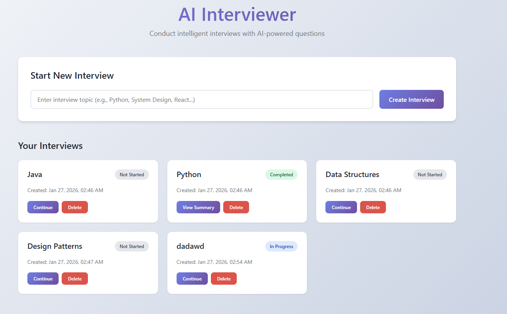
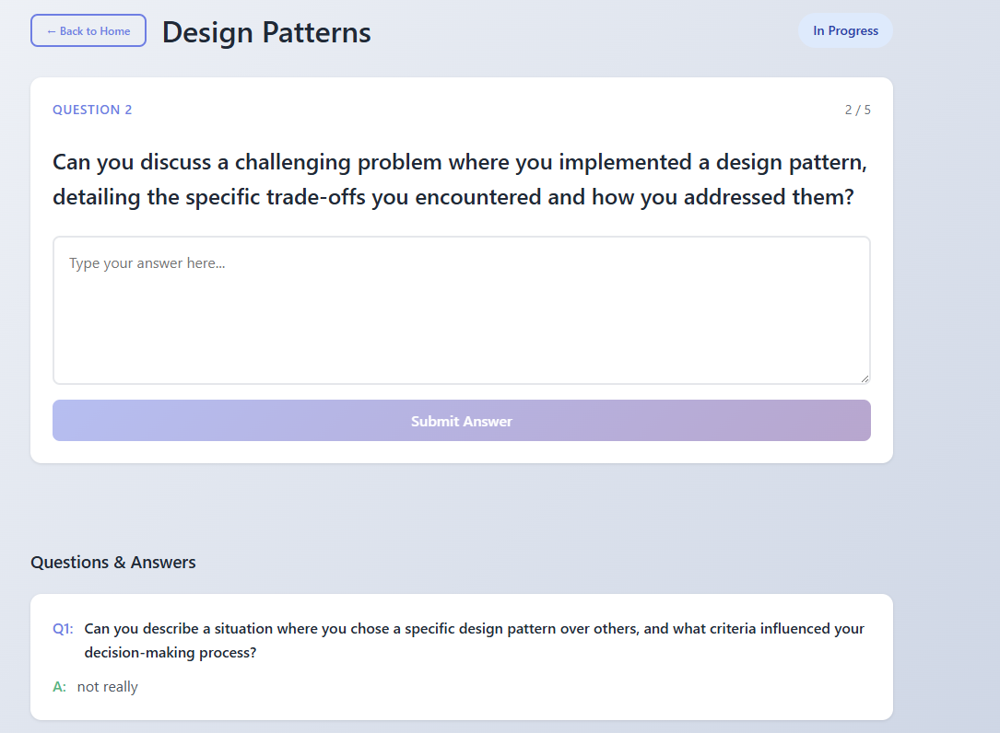
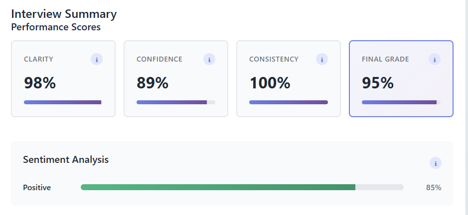
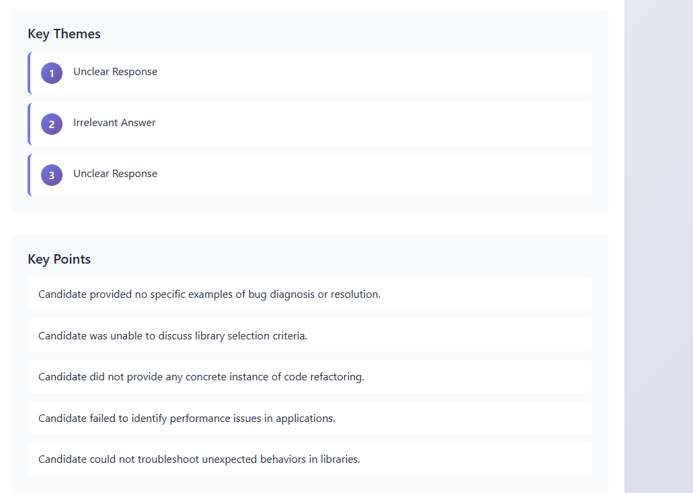
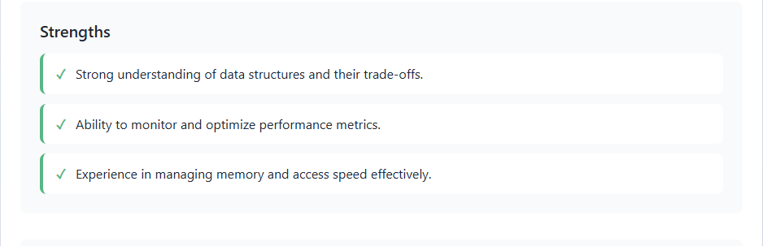
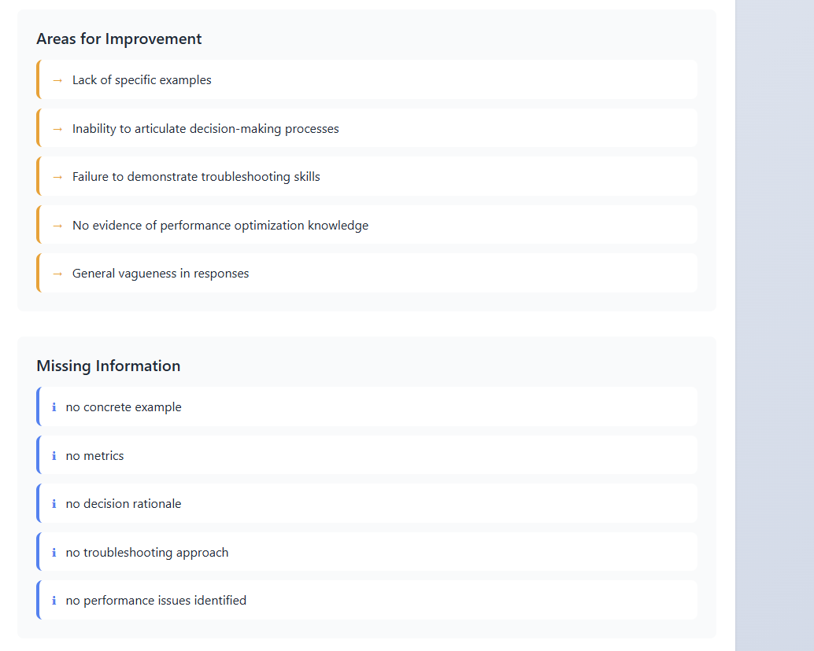
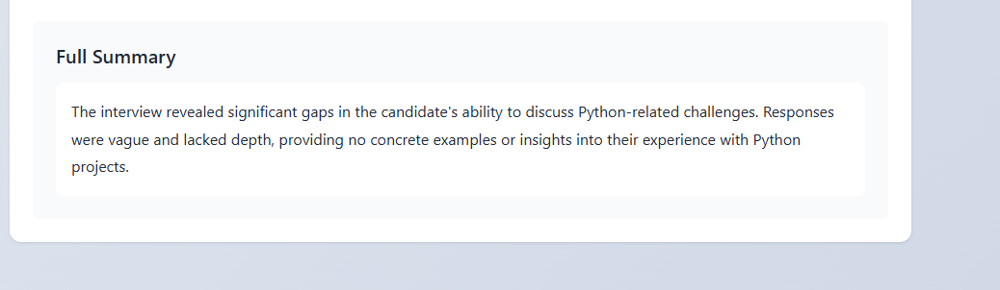

# AI Interviewer

An AI-powered interview system that generates contextual questions and provides comprehensive candidate analysis.



## Features

- **Dynamic Interviews** — Start on any topic; AI generates 3-5 sequential questions that adapt to responses
- **Real-time Analysis** — Sentiment scoring, key themes, strengths/weaknesses identification
- **Performance Metrics** — Clarity, confidence, consistency scores with detailed feedback
- **Full Persistence** — All transcripts and summaries stored in SQLite

### Interview Flow



### Summary & Analysis











## Tech Stack

| Layer | Technology |
|-------|------------|
| Backend | FastAPI, SQLAlchemy, Pydantic |
| Frontend | Vue.js 3, TypeScript, Vite |
| AI | OpenAI API |
| Database | SQLite |

## Quick Start

### Prerequisites

- Python 3.9+
- Node.js 18+
- OpenAI API key

### Backend

```bash
cd backend
python -m venv venv
venv\Scripts\activate        # Windows
# source venv/bin/activate   # macOS/Linux

pip install -r requirements.txt
```

Create `.env` file:

```env
LLM_API_KEY=your-openai-api-key
LLM_MODEL=gpt-4o-mini
```

Run:

```bash
python main.py   
```

API available at `http://localhost:8000` | Docs at `/docs`

### Frontend

```bash
cd frontend
npm install
npm run dev
```

App available at `http://localhost:5173`

## Project Structure

```
├── backend/      # FastAPI (Clean Architecture)
├── frontend/     # Vue.js 3 + TypeScript
└── images/       # Screenshots
```

## Documentation

- [Backend Architecture](backend/README.md) — Clean Architecture, LLM integration, API flow
- [Frontend Guide](frontend/README.md) — Components, services, state management
